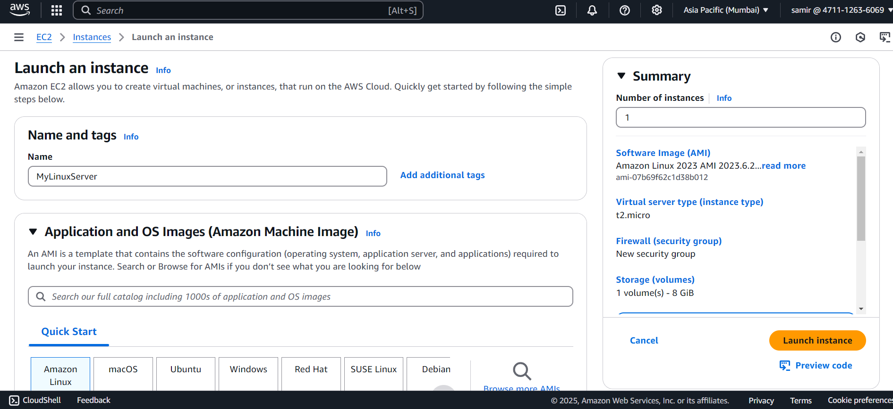
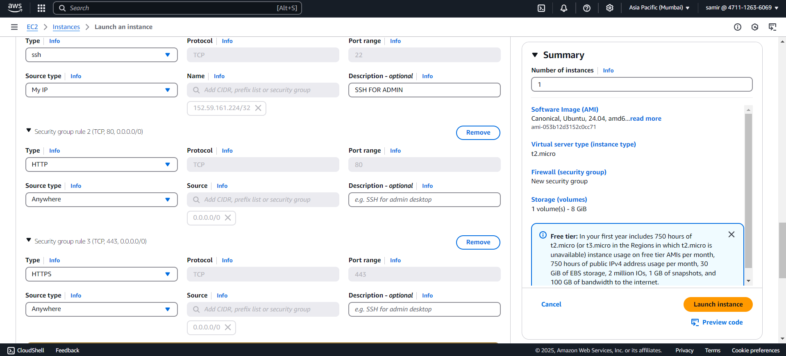
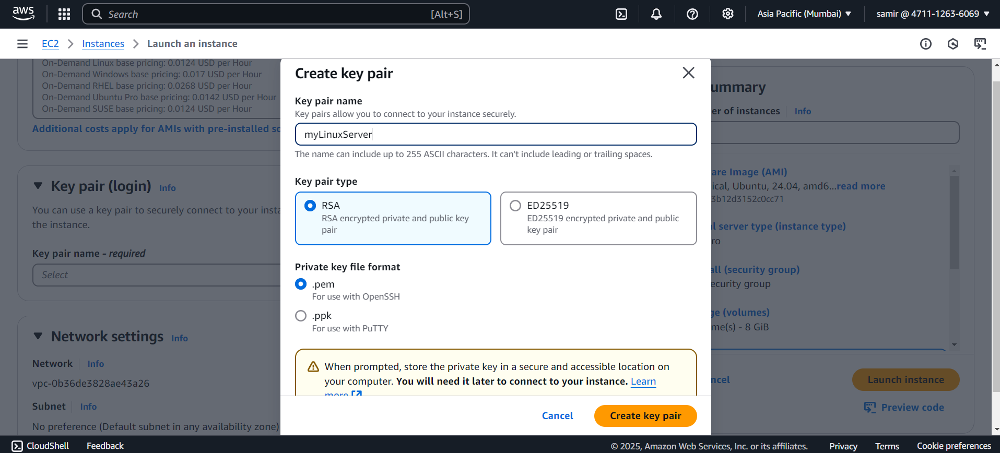
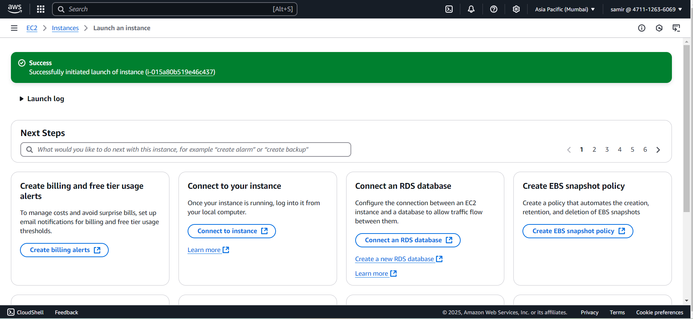
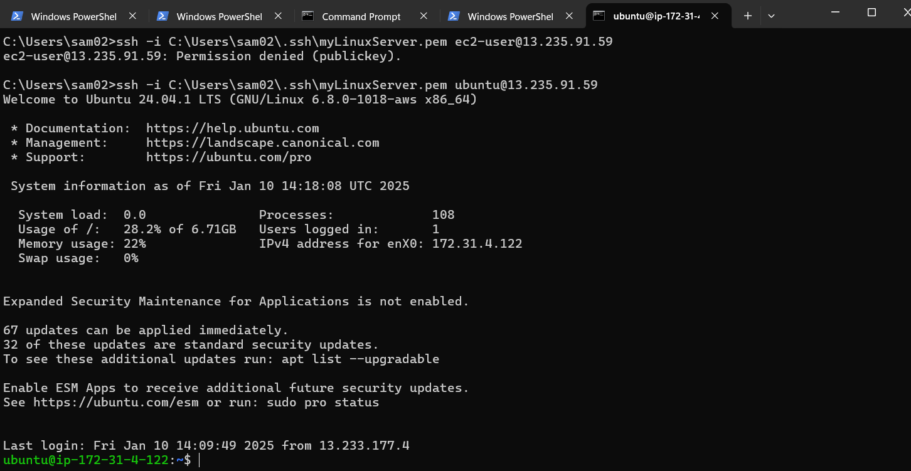

# Provisioning an AWS EC2 Linux Server

This document provides a step-by-step guide to provision an AWS EC2 Linux server and connect to it using SSH.

--

## **1. Setting Up the Environment**

### **Log in to the AWS Management Console**
- Open the [AWS Management Console](https://aws.amazon.com/console/).
- Navigate to the **EC2 Dashboard**.

### **Select a Region**
- Choose the region closest to your location or where the server is required.

---

## **2. Launching the EC2 Instance**

### **Launch Instance**
1. Go to the **Instances** section and click **Launch Instance**.

### **Choose an Amazon Machine Image (AMI)**
- Select a Linux-based AMI:
  - **Amazon Linux 2**
  - **Ubuntu Server 22.04 LTS**

### **Select an Instance Type**
- Choose a suitable instance type (e.g., `t2.micro` for the free tier).

### **Configure Instance Details**
- Use default settings or customize as needed.
- Add tags for easier identification (e.g., `Name: MyLinuxServer`).


### **Add Storage**
- Use default storage (8GB) or increase as necessary.

### **Configure Security Group**
1. Create a new security group or use an existing one.
2. Add the following inbound rule:
   - **Type**: SSH
   - **Protocol**: TCP
   - **Port Range**: 22
   - **Source**: Choose `My IP` (recommended) or `Anywhere (0.0.0.0/0)` for broader access.


### **Review and Launch**
1. Review the instance details and click **Launch**.
2. Select an existing key pair or create a new one.
3. Download the private key file (`.pem`) and store it securely.



---

## **3. Connecting to the Instance**

### **Access the Instance**
1. Go to the **Instances** section on the EC2 Dashboard.
2. Copy the public IP or DNS of your instance.

### **Connect Using SSH**
1. Open your terminal or an SSH client.
2. Run the following command (replace `<path-to-key>` and `<public-IP>`):
   ```bash
   ssh -i <path-to-key> ec2-user@<public-IP>
   ```
   - For Ubuntu AMI, use:
     ```bash
     ssh -i <path-to-key> ubuntu@<public-IP>
     ```

### **Troubleshooting SSH Issues**
- Ensure the private key file has the correct permissions:
  ```bash
  chmod 400 <path-to-key>
  ```
- Check your security group rules to ensure port 22 is open.
- Use verbose mode to debug:
  ```bash
  ssh -v -i <path-to-key> ec2-user@<public-IP>
  ```

---

## **4. Configuring the Server**

### **Update the System**
- Run the following commands after connecting:
  ```bash
  sudo yum update -y  # For Amazon Linux
  sudo apt update && sudo apt upgrade -y  # For Ubuntu
  ```

### **Install Software (Optional)**
- Example: Install Apache
  ```bash
  sudo yum install httpd -y  # For Amazon Linux
  sudo apt install apache2 -y  # For Ubuntu
  ```

---

## **5. Troubleshooting Common Issues**

### **SSH: Permission Denied (Public Key)**
- Ensure the key pair is correct and permissions are set.
- Verify the public key in `~/.ssh/authorized_keys` on the instance.

### **Instance Connect Fails**
- Check security group rules and IAM permissions.
- Use Systems Manager Session Manager if available.


Follow these steps to provision and configure your AWS EC2 Linux server setup!

